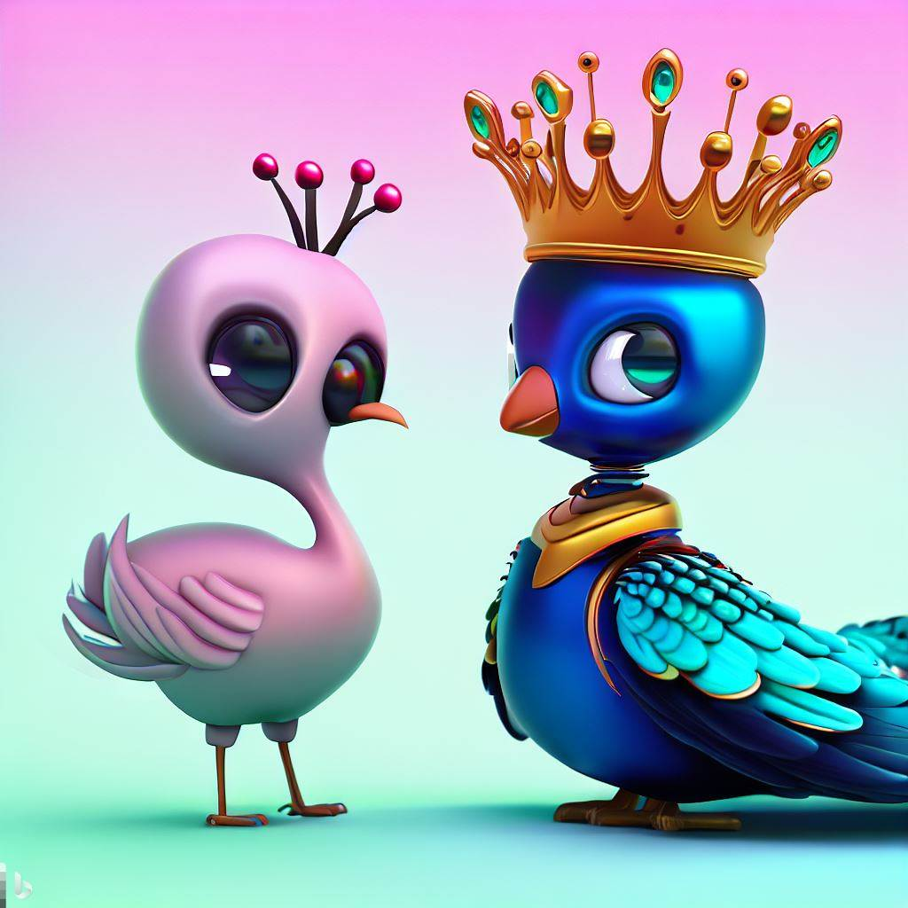
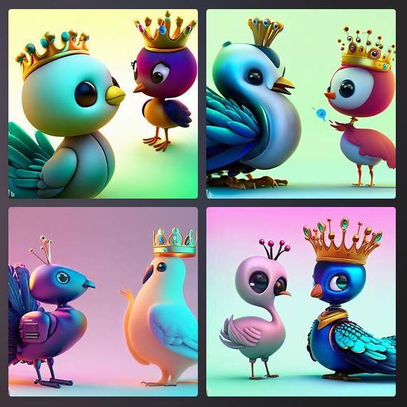
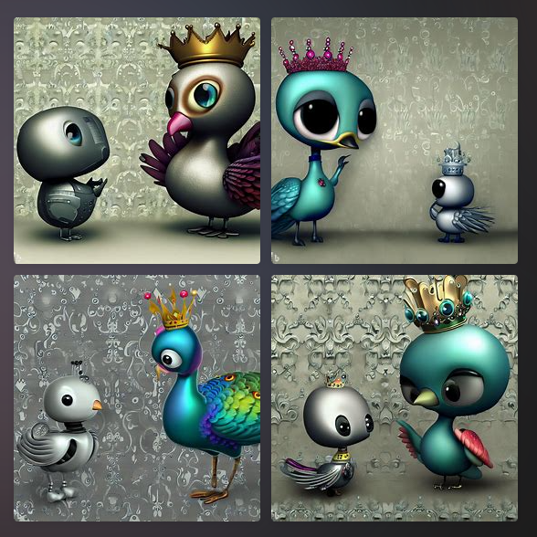
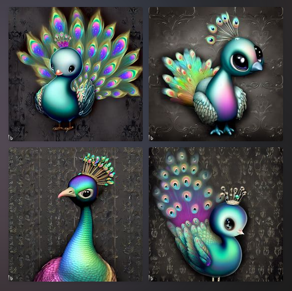
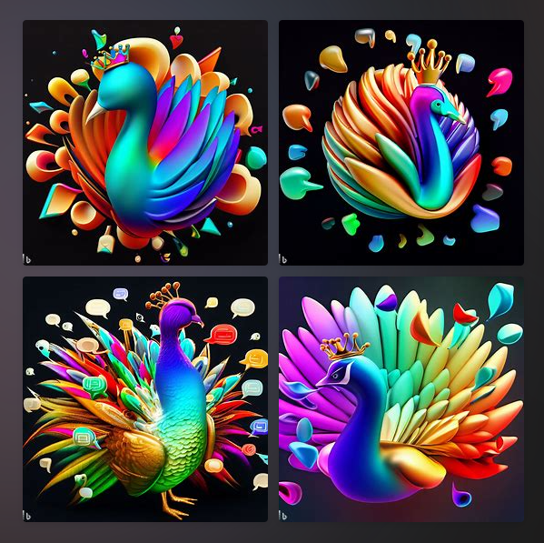
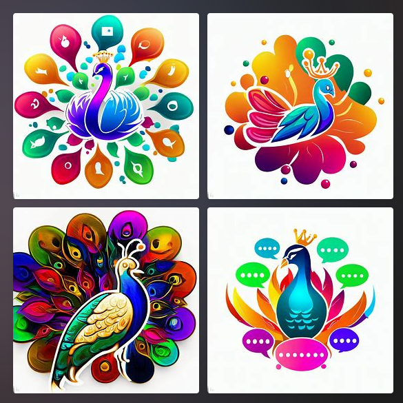

:::info TODAY'S GOAL
 - Set learning objectives
 - Try my first experiment 
 - Document any insights
:::

---

## Learning Objectives

**My goal over the next #100 days** is to:
 - understand Generative AI and Large Language Models (terms & concepts)
 - explore what OpenAI, Midjourney, Hugging Face etc. provide (platforms)
 - get hands-on experience in prompt engineering techniques (AI/UX)
 - apply the learnings in at least one practical project (to be determined)

The related project goal is to publish 1 blog post a day, documenting progress.

## Motivation

 * Generative AI is going mainstream in 2023. In just months, we've seen an explosion in new models, applications and integrations that upend traditional developer and user experiences. **Understanding the new ecosystem is key to participating in it**
 * Because AI can move faster and scale more quickly, any minor issues can get quickly entrenched in models or usage - with potential for real world harm - if not identified early in the development cycle. **Keeping Responsible AI practices in mind from the start, it critical.**
 * From a development perspective, we see multiple platforms, technologies and tools emerging today that can help with _generating_ new experiences,  _remediating_ legacy issues, and _reinventing_ existing solutions. **Getting hands-on experience helps us evaluate benefits & harms better.**
 
The good news is that there are a number of tools, platforms and technologies that are free or competitively-priced, allowing us to explore these in a more hands-on way. I've decided to take 100 days to learn this space by reading, doing and experimenting - and use that to build a more informed foundation from which I can take more responsible steps for development.

My goal is to read, learn or explore, at least one new thing a day. #LetsGo!

## TIL: DALL-E For Images

One of the earliest uses of Generative AI that triggered early buzz was the [DALL-E](https://openai.com/research/dall-e) neural network, a [version of GPT-3](https://arxiv.org/abs/2005.14165) trained to generate **images** from a text **prompt**. My goal today: find a DALL-E based service, play with prompts, and get a sense for the generative AI experience.

### 1. Bing Image Creator

I decided to use the [Microsft Bing Image Creator](https://www.bing.com/images/create) for my experiment. It's an AI-powered "visual stories generator" using an advanced version of DALL-E, and currently [in public preview](https://blogs.microsoft.com/blog/2023/03/21/create-images-with-your-words-bing-image-creator-comes-to-the-new-bing/). The [Terms of Use](https://www.bing.com/new/termsofuse) allow you to use the created images for _legal, personal, non-commercial purposes_. I am using those images in this blog for illustration purposes only - you can see a few in use on my [landing page](/landing).

_Full Disclosure:_ I am a developer advocate at Microsoft. However, I am using my personal account to explore this service for the first time, just like any other user. My opinions here reflect my personal experience only and do not reflect those of my employer. You can see a few other examples on 

### 2: The First Prompt

In my mind, "prompt" is the new verb for actionable intent. We are used to saying "google it" for text-based searches. Now I expect integrated chatbots to say "prompt me" to motivate text-based _conversational experiences_ that generate intelligent multimedia results with AI.

So I wanted DALL-E to generate me a visual that I could use to describe my 100Days journey on this blog. Here are the elements I wanted to see:
 - A peacock - the national bird of India, and the 'vehicle' of the Goddess of Learning
 - A crown - because I wanted to be the "prompt queen" (get it?)
 - A chatbot - to represent the AI conversational element.
 - And I wanted this to have a fun (vs. ultra-realistic) aesthetic.

The Bing Creator FAQ recommends a prompt template with an `adjective` ("cute"), a `noun` ("peacock"), a `verb` ("wearing a crown", "talking to a robot") and a `style` ("digital art"). 

So I crafted my first prompt:

> 🤖 **PROMPT 001**   digital art, 
cute 3d peacock wearing a crown and talking to a cute 3d robot

Hmm .. okay that was a good start. I particularly liked the version in the bottom right - that peacock sideye was a thing of beauty, and the robotic peahen was giving it the perfect staredown to match. 

### 3: The Second Version

But I wanted more textured backgrounds!! So I refined the prompt:

> 🤖 **PROMPT 002**   digital art, 
cute 3d peacock wearing a crown and talking to a cute 3d robot - _on an elegant gray damask background_

**Hmm** - interesting. 
 * The background change is clear, but no foreground image was retained from prior version. 
 * Skin tones are now more aligned to the background colors now. 
 * Having two characters clutters the scene.

Also learned a simple lesson - prompts are not deterministic inputs. Your results will vary, even when the same prompt is re-run. The analogy is that AI is like a student, with the prompt being the assigned art homework. Each version will be unique.

### 4: The Third Version

Okay so let's focus on just one noun(peacock only, no robot or crown), with no verb (wearing, talking), and see if we can refine results by adding more adjectives: _iridiscent_, _dark_

> 🤖 **PROMPT 003**   digital art, 
cute 3D peacock _with iridiscent feathers and a colorful crown_ - against a _dark_ gray damask background

Okay so the dark background works better but removing verbs and nouns kinda took away the key elements. I tried one more iteration using `a 3d image of a cute <creature> wearing a crown - on a dark damask background with chat bubbles` as the prompt. **See the [landing page](/landing)** for results with creature set to {elephant, lion, peacock} respectively. Much better aligned to my goal!

### 5: Prompt To Logo

Hmm. So I wonder if it could design me a _logo_ for this site using the same prompt with added context.

> 🤖 **LAST PROMPT**   3d logo of a colorful peacock with a crown surrounded by chat bubbles, digital art

I could see a couple of these being great for logo usage in a video or image! For completeness, I also tried a version without the `3D` keyword and get this:

The interesting aspect is that the content is vibrant, looks professionally designed and had just minor issues (e.g., missing eyes in some cases). But it also underscores the lack of _uniqueness_ in the creations. I would be hard-pressed to differentiate between a couple of these if used for similar purposes by different applications.

## Takeaways

That was the end of my first foray into prompt creation. Three main takeaways from the perspective of _image_ creation:
 - **Refining prompts is key and there is a lot of trial-and-error**. Focus not so much on the actual words or context used, as on the **template** you create for the prompt in terms of parts of speech used, combinations of elements etc. There is no guarantee of getting the same image refined. Instead think of this as assignments to intelligent art students, who will stick to the rubric but have slightly different interpretations.
 - **There is a cost to usage so tinker wisely in experiments**. There will likely be rate limits on the frequency of 'free' calls to the API, and other constraints in higher tiers. Make _incremental_ prompt changes to gain insight. For instance, I changed the creature type in one iteration, the style type (3d, flat) in another, and the background adjective (elegant, dark) in a third.
 - **There are other side-effects that can be beneficial in unforeseen ways**. In my case, I am trying to be more accessibility aware - and I realized that the prompt text was _perfect for use in captions and alt-text_ for the image when embedded in websites.

## What's Next?

I'm going to spend this week exploring _Prompt Engineering_ at large, before switching gears next week to look at specific models or platforms. Here are the four main sources I use for learning content:
 - Online courses from reputed educators or organizations. 
 - Documentation from relevant platforms and open-source projects.
 - Published books and articles from early adopters and active practitioners.
 - Research papers from academics, exploring systems/UX ideas and challenges.

:::info NEXT GOAL:

Complete the [**ChatGPT Prompt Engineering For Developers**](https://learn.deeplearning.ai/chatgpt-prompt-eng/lesson/1/introduction) online course from Andrew Ng and team at DeepLearning.AI. It's a short (1-hr) video series (currently free) covering usage, tips and applications for prompt engineering.
:::